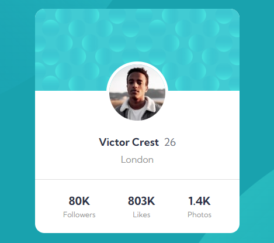

# Frontend Mentor - Profile card component solution

This is a solution to the [Profile card component challenge on Frontend Mentor](https://www.frontendmentor.io/challenges/profile-card-component-cfArpWshJ). Frontend Mentor challenges help you improve your coding skills by building realistic projects. 

## Table of contents

- [Overview](#overview)
  - [The challenge](#the-challenge)
  - [Screenshot](#screenshot)
  - [Links](#links)
  - [Built with](#built-with)
- [Author](#author)

## Overview

### The challenge

Users should be able to:

- View the optimal layout for the interface depending on their device's screen size

### Screenshot

### Links

- Solution URL: (https://github.com/OElmraghy/Profile-card-component)
- Live Site URL: (https://oelmraghy.github.io/Profile-card-component/)

### Built with

- CSS custom properties
- Flexbox

## Author

- Frontend Mentor - [@OElmraghy](https://www.frontendmentor.io/profile/OElmraghy)

